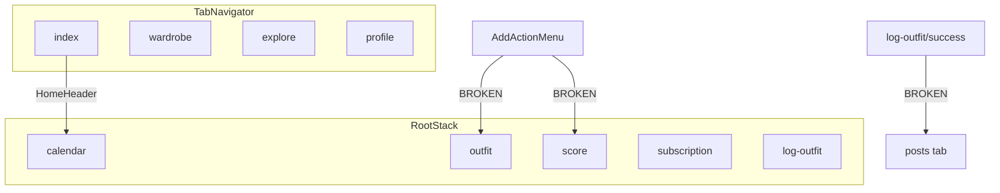

# App Bug Report

**Project:** Look AI (`my-app/`)  
**Date:** June 10, 2026  
**Scope:** Full codebase review — navigation, state/API, UI, billing, onboarding  
**Total bugs found:** 21 (7 High, 9 Medium, 5 Low)

---

## Executive Summary

The app is an Expo Router + React Native wardrobe/outfit tracker with four bottom tabs (Home, Wardrobe, Explore, Profile) and stack screens for calendar, AI features, subscription, and outfit logging.

A recent navigation refactor moved **Calendar** out of the tab bar into a stack screen and added **Explore** as a new tab. Several routes still point at old `(tabs)/` paths that no longer exist, causing **6 broken navigation flows** that users will hit from the + menu, subscription screens, saved outfits, and log-outfit success.

### Top 3 user-facing issues

1. **+ menu actions fail** — "AI outfit" and "Style score" navigate to non-existent tab routes.
2. **Subscription navigation broken** — Premium badge and "Upgrade" buttons use wrong paths.
3. **Log outfit success "View diary" fails** — Points to a removed `posts` tab instead of calendar.

### Severity breakdown

| Severity | Count | Category |
|----------|-------|----------|
| High     | 7     | Broken routes, Supabase cache collision |
| Medium   | 9     | Dead UI, mock data, billing, onboarding |
| Low      | 5     | Stack config, dead code, persistence gaps |

---

## Navigation Architecture



**Current tab order (index 0–3):** Home → Wardrobe → Explore → Profile  
**File:** `my-app/app/(root)/(tabs)/_layout.tsx`

---

## High Severity Bugs

### BUG-001 — Log outfit success navigates to missing `posts` tab

| Field | Detail |
|-------|--------|
| **Severity** | Critical |
| **Component** | Log Outfit / Success screen |
| **File** | `my-app/app/(root)/log-outfit/success.tsx:27` |

**Description**  
After logging an outfit, the "View outfit diary" action calls `router.replace("/(root)/(tabs)/posts")`. There is no `posts` tab. The only `posts.tsx` file lives under `app/UNNECESSARY/` and is not part of the active route tree.

**Steps to reproduce**
1. Open the app and tap the + button in the tab bar.
2. Choose "Log outfit" and complete the flow through camera → success.
3. Tap the diary/view CTA on the success screen.

**Expected:** Navigate to the outfit calendar/diary screen.  
**Actual:** Navigation fails or shows an unmatched route screen.

**Suggested fix**
```ts
router.replace("/(root)/calendar" as never);
```

---

### BUG-002 — AddActionMenu "AI outfit" uses wrong tab route

| Field | Detail |
|-------|--------|
| **Severity** | High |
| **Component** | Add Action Menu (+ button) |
| **File** | `my-app/components/navigation/AddActionMenu.tsx:52` |

**Description**  
The AI outfit card route is `/(root)/(tabs)/outfit`, but the screen file is at `app/(root)/(ai-features)/outfit.tsx`. The correct path is `/(root)/outfit`.

**Steps to reproduce**
1. Tap the + button in the tab bar.
2. Tap "AI outfit".

**Expected:** Open the AI outfit generation screen.  
**Actual:** Route does not resolve; screen fails to load.

**Suggested fix**
```ts
route: "/(root)/outfit",
```

---

### BUG-003 — AddActionMenu "Style score" uses wrong tab route

| Field | Detail |
|-------|--------|
| **Severity** | High |
| **Component** | Add Action Menu (+ button) |
| **File** | `my-app/components/navigation/AddActionMenu.tsx:60` |

**Description**  
The style score card route is `/(root)/(tabs)/score`, but the screen is at `app/(root)/(analytics)/score.tsx`. The correct path is `/(root)/score`.

**Steps to reproduce**
1. Tap the + button in the tab bar.
2. Tap "Style score".

**Expected:** Open the style score screen.  
**Actual:** Route does not resolve.

**Suggested fix**
```ts
route: "/(root)/score",
```

---

### BUG-004 — Saved outfits "Explore" button uses wrong route

| Field | Detail |
|-------|--------|
| **Severity** | High |
| **Component** | Saved Outfits |
| **File** | `my-app/app/(root)/(wardrobe)/saved.tsx:352` |

**Description**  
The empty-state explore handler pushes `/(root)/(tabs)/outfit`, which is not a tab route.

**Steps to reproduce**
1. Go to Wardrobe tab → Saved.
2. Trigger the explore action (empty state CTA).

**Expected:** Navigate to AI outfit screen at `/(root)/outfit`.  
**Actual:** Navigation fails.

**Suggested fix**
```ts
router.push("/(root)/outfit" as never);
```

---

### BUG-005 — Subscription premium badge navigates to wrong path

| Field | Detail |
|-------|--------|
| **Severity** | High |
| **Component** | Subscription |
| **File** | `my-app/app/(root)/(subscription)/subscription.tsx:99` |

**Description**  
Premium users tapping the active-plan badge are sent to `/(root)/(tabs)/manage-subscription`. Manage subscription is a stack screen at `app/(root)/(subscription)/manage-subscription.tsx`, not a tab.

**Steps to reproduce**
1. Navigate to the subscription screen as a premium user.
2. Tap the premium badge row.

**Expected:** Open manage subscription screen.  
**Actual:** Navigation fails.

**Suggested fix**
```ts
router.push("/(root)/manage-subscription" as never)
```

---

### BUG-006 — Manage subscription "Upgrade" navigates to wrong path

| Field | Detail |
|-------|--------|
| **Severity** | High |
| **Component** | Manage Subscription |
| **File** | `my-app/app/(root)/(subscription)/manage-subscription.tsx:83` |

**Description**  
The upgrade handler pushes `/(root)/(tabs)/subscription` instead of `/(root)/subscription`.

**Steps to reproduce**
1. Open manage subscription screen.
2. Tap "Upgrade" (or equivalent CTA).

**Expected:** Navigate to subscription plans screen.  
**Actual:** Navigation fails.

**Suggested fix**
```ts
router.push("/(root)/subscription" as never);
```

---

### BUG-007 — Supabase query cache ignores filter parameters

| Field | Detail |
|-------|--------|
| **Severity** | High |
| **Component** | Data layer / Supabase hooks |
| **File** | `my-app/backend/hooks/useSupabaseQuery.ts:26-28, 58-62` |

**Description**  
The in-memory cache key is built as `table::select` only. The `apply` callback filters (e.g. `user_id`, date period in `useWardrobeSummary`) are not part of the key. Different queries against the same table with different filters share one cache entry for up to 30 seconds.

**Steps to reproduce**
1. Load wardrobe summary for user A.
2. Switch accounts or change filter period within 30 seconds.
3. Observe stale data from the previous query.

**Expected:** Each distinct filtered query returns its own data.  
**Actual:** Cached data from an earlier filter may be served incorrectly.

**Suggested fix**  
Include serialized filter parameters in the cache key, or disable caching when `apply` is provided.

---

## Medium Severity Bugs

### BUG-008 — Explore screen has wrong `tabIndex`

| Field | Detail |
|-------|--------|
| **Severity** | Medium |
| **Component** | Explore tab |
| **File** | `my-app/app/(root)/(tabs)/explore.tsx:9` |

**Description**  
`SwipeTabWrapper` is passed `tabIndex={3}`, but Explore is tab index **2** (0=Home, 1=Wardrobe, 2=Explore, 3=Profile). Profile correctly uses `tabIndex={3}`.

**Steps to reproduce**  
No visible effect today — `SwipeTabWrapper` currently ignores `tabIndex`.

**Expected:** `tabIndex={2}` for Explore.  
**Actual:** Wrong index documented; will break if swipe logic is implemented in the wrapper.

**Suggested fix**
```tsx
<SwipeTabWrapper tabIndex={2}>
```

---

### BUG-009 — Saved outfits filter chips "Clothes" and "Inspo" always empty

| Field | Detail |
|-------|--------|
| **Severity** | Medium |
| **Component** | Saved Outfits |
| **File** | `my-app/app/(root)/(wardrobe)/saved.tsx:54, 342-345` |

**Description**  
Filter chips include "All", "Outfits", "Clothes", and "Inspo", but `filteredOutfits` only returns data for "All" and "Outfits". Selecting "Clothes" or "Inspo" always yields an empty list.

**Steps to reproduce**
1. Open Saved screen with saved outfits visible.
2. Tap "Clothes" or "Inspo" chip.

**Expected:** Filtered results for that category.  
**Actual:** Empty grid regardless of content.

**Suggested fix**  
Implement filtering logic for Clothes/Inspo, or remove unused chips until supported.

---

### BUG-010 — Cloth details ignores `id` route parameter

| Field | Detail |
|-------|--------|
| **Severity** | Medium |
| **Component** | Cloth Details |
| **File** | `my-app/app/(root)/cloth-details/[id].tsx:15-25` |

**Description**  
The screen reads `id` from `useLocalSearchParams` but never uses it. All wardrobe item taps show the same hardcoded mock item ("Classic Beige Trench").

**Steps to reproduce**
1. Go to Wardrobe tab.
2. Tap any clothing item.

**Expected:** Details for the tapped item.  
**Actual:** Same static mock data for every item.

**Suggested fix**  
Fetch item by `id` from Supabase or pass item data via params.

---

### BUG-011 — Profile "Upgrade Now" button has no handler

| Field | Detail |
|-------|--------|
| **Severity** | Medium |
| **Component** | Profile tab |
| **File** | `my-app/app/(root)/(tabs)/profile.tsx:269-288` |

**Description**  
The "Upgrade Now" `Pressable` inside the premium promo card has no `onPress` prop. Tapping it does nothing.

**Steps to reproduce**
1. Open Profile tab.
2. Tap "Upgrade Now" on the promo card.

**Expected:** Navigate to subscription screen.  
**Actual:** No response to tap.

**Suggested fix**
```tsx
<Pressable
  onPress={() => router.push("/(root)/subscription" as never)}
  ...
>
```

---

### BUG-012 — Onboarding trust screen silently ignores save errors

| Field | Detail |
|-------|--------|
| **Severity** | Medium |
| **Component** | Onboarding |
| **File** | `my-app/app/(root)/onboarding/trust.tsx:14-17` |

**Description**  
The final onboarding step calls `completeOnboarding(userId, supabase)` but does not read or display the `error` from the onboarding store. Compare with `setup-account.tsx`, which surfaces errors to the user.

**Steps to reproduce**
1. Complete onboarding through to the trust screen.
2. Trigger a save failure (e.g. network error).
3. Tap Continue.

**Expected:** Error message shown; user can retry.  
**Actual:** Failure is silent; user may remain stuck with no feedback.

**Suggested fix**  
Destructure `error` from `useOnboardingState()` and display it below the continue button.

---

### BUG-013 — Onboarding photo upload uses wrong content type

| Field | Detail |
|-------|--------|
| **Severity** | Medium |
| **Component** | Onboarding |
| **File** | `my-app/app/(root)/onboarding/full-length-pics.tsx:66-79` |

**Description**  
The code correctly computes `contentType` from `asset.mimeType` for the FormData blob, but passes `contentType: "multipart/form-data"` to `supabase.storage.upload()`. Supabase expects the actual image MIME type (e.g. `image/jpeg`).

**Steps to reproduce**
1. Reach the full-length pics onboarding step.
2. Select photos and upload.

**Expected:** Photos upload to Supabase storage.  
**Actual:** Upload may fail or store files with incorrect metadata.

**Suggested fix**
```ts
.upload(fileName, formData, {
  contentType: contentType, // use computed MIME type
  upsert: false,
});
```

---

### BUG-014 — Home header streak is hardcoded

| Field | Detail |
|-------|--------|
| **Severity** | Medium |
| **Component** | Home Header |
| **File** | `my-app/components/ui/HomeHeader.tsx:12, 33` |

**Description**  
Streak count is initialized with `useState<number>(1)` and never updated from real streak data (e.g. from `/(root)/streak` or wardrobe summary).

**Steps to reproduce**
1. Open Home tab.
2. Compare streak badge with actual streak screen data.

**Expected:** Live streak count.  
**Actual:** Always shows "1 day".

**Suggested fix**  
Fetch streak from Supabase or shared store and bind to the header.

---

### BUG-015 — Billing silently no-ops on non-Android platforms

| Field | Detail |
|-------|--------|
| **Severity** | Medium |
| **Component** | Billing |
| **File** | `my-app/billing/store.ts:50` |

**Description**  
`initBilling` returns immediately when `Platform.OS !== "android"`. All purchase, restore, and entitlement flows are unavailable on iOS with no user-facing message.

**Steps to reproduce**
1. Run app on iOS simulator or device.
2. Navigate to subscription and attempt purchase.

**Expected:** Platform-appropriate billing (StoreKit) or clear "not available" message.  
**Actual:** Billing never initializes; features appear broken silently.

**Suggested fix**  
Add iOS StoreKit support or show an explicit unsupported-platform message in the UI.

---

### BUG-016 — Log outfit camera skips analyzing flow

| Field | Detail |
|-------|--------|
| **Severity** | Medium |
| **Component** | Log Outfit |
| **Files** | `my-app/app/(root)/log-outfit/camera.tsx:72-76`, `my-app/app/(root)/log-outfit/analyzing.tsx` |

**Description**  
After capture, `goToAnalyzing` calls `startAnalysis(uri)` but navigates directly to `/(root)/(tabs)` instead of `/(root)/log-outfit/analyzing`. The analyzing → confirm → details → success chain exists but is orphaned (no in-app navigation reaches `analyzing.tsx`).

**Steps to reproduce**
1. Log an outfit via camera.
2. Observe navigation goes to home tabs, not analyzing screen.

**Expected:** Camera → analyzing → confirm → details → success.  
**Actual:** Camera → tabs; analyzing screen unreachable in normal flow.

**Suggested fix**
```ts
router.replace("/(root)/log-outfit/analyzing" as never);
```

---

## Low Severity Bugs

### BUG-017 — Root stack missing explicit screen entries

| Field | Detail |
|-------|--------|
| **Severity** | Low |
| **Component** | Root layout |
| **File** | `my-app/app/(root)/_layout.tsx:11-29` |

**Description**  
Screens like `calendar`, `saved`, `score`, and `subscription` are not listed in `Stack.Screen` entries, unlike `streak`, `trend-feed`, and `look-ai`. File-based routing still resolves them, but custom animations/options may not apply.

**Suggested fix**  
Add `<Stack.Screen name="calendar" />` and other missing screens for consistent stack behavior.

---

### BUG-018 — Supabase query stays loading when `enabled: false`

| Field | Detail |
|-------|--------|
| **Severity** | Low |
| **Component** | Data layer |
| **File** | `my-app/backend/hooks/useSupabaseQuery.ts:53-54` |

**Description**  
When `enabled === false`, `fetchData` returns early without calling `setLoading(false)`. The hook remains in `loading: true` until `enabled` becomes true.

**Suggested fix**  
Set `setLoading(false)` in the early-return path when disabled.

---

### BUG-019 — Save actions do not persist to Supabase

| Field | Detail |
|-------|--------|
| **Severity** | Low |
| **Component** | Add Clothes / Log Outfit |
| **Files** | `my-app/app/(root)/add-clothes/form.tsx:87-96`, `my-app/app/(root)/log-outfit/details.tsx:29-30` |

**Description**  
"Save" handlers only navigate to success screens. No Supabase insert/update is performed. Wardrobe tab also uses `MOCK_ITEMS`. Data is lost on app restart.

**Steps to reproduce**
1. Add a clothing item or log an outfit and save.
2. Restart the app.

**Expected:** Item/outfit appears in wardrobe/calendar.  
**Actual:** Data not persisted (mock/local only).

**Suggested fix**  
Wire save handlers to Supabase tables defined in `supabase/schema.sql`.

---

### BUG-020 — Setup account screen is unreachable

| Field | Detail |
|-------|--------|
| **Severity** | Low |
| **Component** | Onboarding |
| **File** | `my-app/app/(root)/onboarding/setup-account.tsx` |

**Description**  
The setup-account screen auto-calls `completeOnboarding` and displays errors properly, but the onboarding flow ends at `trust.tsx` (nickname → trust). No route navigates to setup-account.

**Suggested fix**  
Either integrate into the flow (trust → setup-account) or remove the dead screen.

---

### BUG-021 — CustomTabBar type mismatch and unused imports

| Field | Detail |
|-------|--------|
| **Severity** | Low |
| **Component** | Tab bar |
| **File** | `my-app/components/navigation/CustomTabBar.tsx:1, 11-15` |

**Description**  
`CustomTabBar` imports `BottomTabBarProps` from `@react-navigation/bottom-tabs` but is used with `MaterialTopTabs`. Several icon imports (`IconHanger`, `IconSparkles`, `IconTrendingUp`, `IconBookmark`, `IconCalendar`) are unused after the calendar tab migration.

**Suggested fix**  
Use material top tabs prop types; remove unused imports.

---

## Working Correctly

These routes and flows were verified as valid:

| Flow | Route | File |
|------|-------|------|
| Calendar from home header | `/(root)/calendar` | `my-app/app/(root)/calendar.tsx` |
| Streak from home header | `/(root)/streak` | `my-app/app/(root)/(analytics)/streak.tsx` |
| Trend feed | `/(root)/trend-feed` | `my-app/app/(root)/(social)/trend-feed.tsx` |
| Look AI banner | `/(root)/look-ai` | `my-app/app/(root)/(ai-features)/look-ai.tsx` |
| Wardrobe → cloth details | `/(root)/cloth-details/[id]` | Dynamic route exists |
| Wardrobe → add clothes | `/(root)/add-clothes` | Stack flow exists |
| Wardrobe → saved | `/(root)/saved` | `my-app/app/(root)/(wardrobe)/saved.tsx` |
| Tab bar navigation | index, wardrobe, explore, profile | All files match `_layout.tsx` |
| Auth routing | sign-in → onboarding → tabs | `my-app/app/_layout.tsx` |

---

## Recommended Fix Priority

### Phase 1 — Broken navigation (immediate)

1. **BUG-001** — Fix log-outfit success diary route → `/(root)/calendar`
2. **BUG-002, BUG-003** — Fix AddActionMenu outfit/score routes
3. **BUG-004** — Fix saved outfits explore route
4. **BUG-005, BUG-006** — Fix subscription cross-links

### Phase 2 — Data integrity

5. **BUG-007** — Fix Supabase cache key to include filters
6. **BUG-013** — Fix onboarding upload content type
7. **BUG-012** — Surface onboarding errors on trust screen

### Phase 3 — UX completeness

8. **BUG-011** — Wire profile Upgrade button
9. **BUG-016** — Restore log-outfit analyzing flow
10. **BUG-010** — Fetch cloth details by ID
11. **BUG-009** — Fix or remove broken filter chips
12. **BUG-014** — Connect streak to real data

### Phase 4 — Platform and cleanup

13. **BUG-015** — iOS billing or explicit unsupported message
14. **BUG-019** — Add Supabase persistence for saves
15. **BUG-008, BUG-017, BUG-018, BUG-020, BUG-021** — Low-priority cleanup

---

## Notes

- No TypeScript or ESLint errors were reported in the current tree.
- Many routes use `as never` casts, which bypass Expo Router's typed route checking and hide broken paths at compile time.
- The calendar tab → stack screen migration in uncommitted changes is partially complete: `HomeHeader` was updated, but dependent routes were not.
